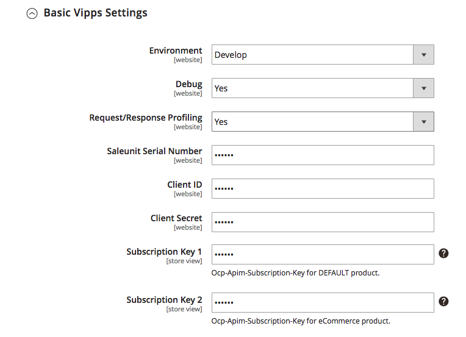

# Vipps Payment Module for Magento 2: Installation

# Prerequisites

1. [Magento 2.2](https://devdocs.magento.com/guides/v2.2/release-notes/bk-release-notes.html) or later
1. SSL must be installed on your site and active on your Checkout pages.
1. You must have a Vipps merchant account. See [Vipps på Nett](https://www.vipps.no/bedrift/vipps-pa-nett)
1. As with _all_ Magento extensions, it is highly recommended to backup your site before installation and to install and test on a staging environment prior to production deployments.

# Installation via Composer (recommended)

1. Navigate to your [Magento root directory](https://devdocs.magento.com/guides/v2.2/extension-dev-guide/build/module-file-structure.html).
1. Enter command: `composer require vipps/module-payment`
1. Enter command: `php bin/magento module:enable Vipps_Payment` 
1. Enter command: `php bin/magento setup:upgrade`
1. Put your Magento in production mode if it’s required.

# Installation via Marketplace

**Please note:** _This extension is not yet available on Magento Marketplace. This notice will be removed when it is._

Here are steps required to install Payments extension via Component Manager.

1. Make a purchase for the Vipps extension on [Magento Marketplace](https://marketplace.magento.com).
1. From your `Magento Admin` access `System` -> `Web Setup Wizard` page.
1. Enter Marketplace authentication keys. Please read about authentication keys generation. 
1. Navigate to `Component Manager` page.
1. On the `Component Manager` page click the `Sync button to update your new purchased extensions.
1. Click `Install` in the `Action` column for `Realex Payments` component.
1. . Follow Web Setup Wizard instructions.

# Configuration

The Vipps Payment module can be easily configured to meet business expectations of your web store. This section will show you how to configure the extension via `Magento Admin`.

From Magento Admin navigate to `Store` -> `Configuration` -> `Sales` -> `Payment Methods` section. On the Payments Methods page the Vipps Payments method should be listed together with other installed payment methods in a system.

By clicking the `Configure` button, all configuration module settings will be shown. Once you have finished with the configuration simply click `Close` and `Save` button for your convenience.

# Settings

Vipps Payments configuration is divided by sections. It helps to quickly find and manage settings of each module feature:

1. Basic Vipps Settings.
1. Express Checkout Settings.

Please ensure you check all configuration settings prior to using Vipps Payment. Pay attention to the Vipps Basic Settings section, namely `Saleunit Serial Number`, `Client ID`, `Client Secret`, `Subscription Key 1`, `Subscription Key 2`.

# Basic Vipps Settings

# Express Checkout Settings

# Support

Magento is an open source ecommerce solution: https://magento.com

Magento Inc is an Adobe company: https://magento.com/about

For Magento support, see Magento Help Center: https://support.magento.com/hc/en-us

Vipps has a dedicated team ready to help: magento@vipps.no
